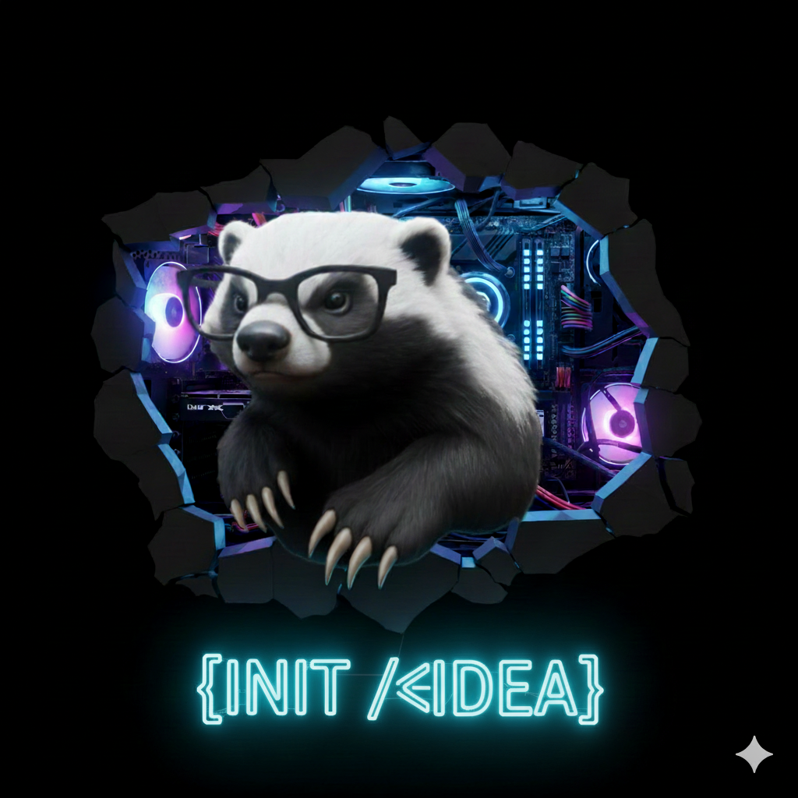

# {INIT /<IDEA>} - Studio Digital Integral



## 🎯 Code. Create. Connect.

**Transformamos ideas en soluciones digitales efectivas y creativas.**

> **Nota importante**: El nombre del proyecto es `{INIT /<IDEA>}` - los caracteres `{ } / < >` son parte del nombre del proyecto y deben mostrarse como texto literal.

---

## 🌟 Sobre Nosotros

{INIT /<IDEA>} es un Studio Digital Integral especializado en ofrecer soluciones creativas y tecnológicas de alto impacto. Desde marketing digital hasta desarrollo de aplicaciones, brindamos servicios completos para impulsar tu presencia digital.

---

## 🚀 Servicios

### 📱 Marketing Digital
- Estrategias personalizadas para redes sociales
- Optimización de contenido y Social Media Management
- Marketing digital musical y promoción de artistas
- Tiendas online flexibles y personalizadas

### 💻 Diseño y Desarrollo Web & Apps
- Diseño web profesional y responsivo
- Desarrollo de aplicaciones móviles personalizadas
- Automatizaciones con IA
- Soluciones web escalables

### 🎥 Producción Multimedia
- Fotografía profesional
- Producción de video creativo
- Edición y material digital para redes sociales
- Contenido audiovisual para marketing

### 🎨 Branding & Diseño Gráfico
- Diseño de logotipos e identidad corporativa
- Banners, flyers y material promocional
- Portadas y contenido visual para redes sociales
- Material digital optimizado para plataformas

### 🛠️ Soporte & Consultoría
- Reparación y mantenimiento de equipos de cómputo y móviles
- Asistencia virtual y oficina virtual
- Trámites: registro de marca IMPI, pasaportes, actas de nacimiento, CURP
- Consultoría tecnológica personalizada

---

## 💡 ¿Por Qué Elegirnos?

### ✅ Flexibilidad
Trabajamos con cualquier presupuesto, desde pequeños emprendimientos hasta empresas consolidadas. Adaptamos nuestras soluciones a tus necesidades específicas.

### ✅ Creatividad
Cada proyecto se desarrolla con innovación y pasión. Buscamos soluciones únicas que destaquen tu marca en el mundo digital.

### ✅ Colaboración
Abiertos a alianzas, colaboraciones y nuevos retos. Trabajamos contigo en cada etapa del proceso para garantizar resultados óptimos.

### ✅ Resultados Reales
Soluciones adaptadas a cada cliente para generar impacto medible. Nos enfocamos en entregar valor tangible y crecimiento sostenible.

---

## 📞 Contacto

### 📧 Email
5410m0n.r4m1r3z@gmail.com

### 📱 Teléfonos
- **Personal**: +52 777 238 3264
- **Studio**: +52 777 710 7522

### 🌐 Redes Sociales
- [Facebook](https://www.facebook.com/profile.php?id=61582855106237)
- [Instagram](https://www.instagram.com/alexros2.0/)
- [TikTok](https://www.tiktok.com/@alexros2.0)
- [YouTube](https://youtube.com/@salomonramirezortega?si=7W63IoK4djKSzR3Q)
- [LinkedIn](https://www.linkedin.com/company/init-idea/)
- [GitHub](https://github.com/5410m0n0c001)
- [Discord](https://discord.gg/4kHSzxNz)

### 🌍 Sitio Web
[https://5410m0n0c001.github.io/INIT-IDEA](https://5410m0n0c001.github.io/INIT-IDEA)

### 📍 Ubicación
Ciudad Valles, San Luis Potosí, México

---

## 🛠️ Tecnologías del Sitio Web

Este sitio fue construido con las siguientes tecnologías modernas:

- **HTML5** - Estructura semántica moderna
- **CSS3** - Diseño responsivo con efectos avanzados
  - Glassmorphism
  - Neomorphism
  - 3D Transforms
  - Neon Glow Effects
  - Gradient Animations
- **JavaScript ES6+** - Interactividad moderna
- **GSAP + ScrollTrigger** - Animaciones profesionales
- **Responsive Design** - Mobile-first approach
- **GitHub Pages** - Hosting gratuito y confiable

---

## ✨ Características Destacadas

### ✅ Efectos Visuales Avanzados
- Efectos 3D en cards con mouse tracking
- Parallax scrolling en videos
- Animaciones fluidas con GSAP
- Glassmorphism y efectos de neón
- Transiciones suaves y profesionales

### ✅ Experiencia de Usuario
- Diseño completamente responsivo
- Optimización de rendimiento
- Accesibilidad mejorada
- Carga rápida y optimizada
- Navegación intuitiva

### ✅ Funcionalidades Técnicas
- Background music con control
- Efectos de ripple en botones
- Scroll animations avanzadas
- Optimización para móviles
- Compatibilidad cross-browser

---

## 📁 Estructura del Proyecto
INIT-IDEA/
├── index.html # HTML principal
├── styles.css # Estilos CSS completos
├── script.js # JavaScript con funcionalidades
├── header-video.mp4 # Video de fondo del header
├── footer-video.mp4 # Video de fondo del footer
├── hero-video.mp4 # Video de la sección about
├── logo.png # Logo para metadatos
├── music.mp3 # Música de fondo (opcional)
├── .nojekyll # Configuración GitHub Pages
└── README.md # Este archivo

text

---

## 🚀 Deployment en GitHub Pages

### Pasos para Desplegar

1. **Crear repositorio** en GitHub llamado `INIT-IDEA`
2. **Subir todos los archivos** al repositorio
3. **Habilitar GitHub Pages**:
   - Settings → Pages
   - Source: Deploy from branch
   - Branch: main (o master)
   - Folder: / (root)
4. **Esperar el deployment** (2-5 minutos)
5. **Acceder al sitio** en: `https://TU-USUARIO.github.io/INIT-IDEA`

### Archivo .nojekyll
El archivo `.nojekyll` está incluido para asegurar que GitHub Pages procese correctamente todos los archivos sin restricciones de Jekyll.

---

## 💻 Desarrollo Local

### Requisitos
- Navegador moderno (Chrome, Firefox, Safari, Edge)
- Servidor local (opcional pero recomendado)

### Ejecutar Localmente

**Opción 1: Servidor Python**
```bash
python -m http.server 8000
# Abrir: http://localhost:8000
Opción 2: Servidor Node

bash
npx serve
# Abrir: http://localhost:3000
Opción 3: Live Server (VS Code)

Instalar extensión "Live Server"

Click derecho en index.html

Seleccionar "Open with Live Server"

🎨 Paleta de Colores
Color	Hex	Uso
Cyan Neón	#00FFFF	Primario, acentos, efectos glow
Violeta	#A366FF	Secundario, gradientes
Negro Puro	#000000	Fondos oscuros
Gris Oscuro	#111111	Fondos principales
Blanco Puro	#FFFFFF	Textos principales
Gris Texto	#333333	Textos secundarios
🔤 Tipografía
Orbitron - Headers y títulos tech

Poppins - Cuerpo de texto y contenido

JetBrains Mono - Elementos monospace (detalles técnicos)

📱 Soporte de Navegadores
Navegador	Versión Mínima
Chrome	90+
Firefox	88+
Safari	14+
Edge	90+
iOS Safari	14+
Android Chrome	90+
⚡ Optimizaciones
Performance
Lazy loading de videos

Intersection Observer para animaciones

Debounced scroll events

Optimización de GSAP animations

CSS will-change para elementos animados

Mobile
Touch targets mínimo 48x48px

Viewport optimizado para iOS

Grid responsive con auto-fit

Media queries para todos los breakpoints

Haptic feedback en dispositivos compatibles

Accessibility
Semantic HTML5

ARIA labels donde necesario

Contraste de colores WCAG AA

Keyboard navigation

Reduced motion support

🐛 Troubleshooting
Los videos no se reproducen
Verificar que los archivos .mp4 estén en la raíz del proyecto

Verificar permisos de archivos

En móvil: los videos requieren el atributo playsinline

Las animaciones no funcionan
Verificar que GSAP esté cargado correctamente

Abrir consola del navegador para ver errores

Verificar que ScrollTrigger esté registrado

Los botones sociales se superponen en móvil
Verificar media queries en styles.css

Ajustar grid-gap y padding si es necesario

Reducir tamaño de fuente si es necesario

GitHub Pages no actualiza
Esperar 2-5 minutos después de push

Limpiar caché del navegador (Ctrl + F5)

Verificar en Settings → Pages el estado del deployment

📝 Licencia
© 2025 {INIT /<IDEA>} Studio Digital. Todos los derechos reservados.

🤝 Colaboraciones
Estamos abiertos a colaboraciones, alianzas estratégicas y proyectos innovadores.

¡Contáctanos para trabajar juntos!

📮 Descargar Contacto
Descarga nuestra información de contacto en formato vCard para agregar directamente a tus contactos.

📥 Descargar vCard (Botón disponible en el sitio web)

{INIT /<IDEA>} - Code. Create. Connect. 🚀

Made with ❤️ in Ciudad Valles, San Luis Potosí, México

text